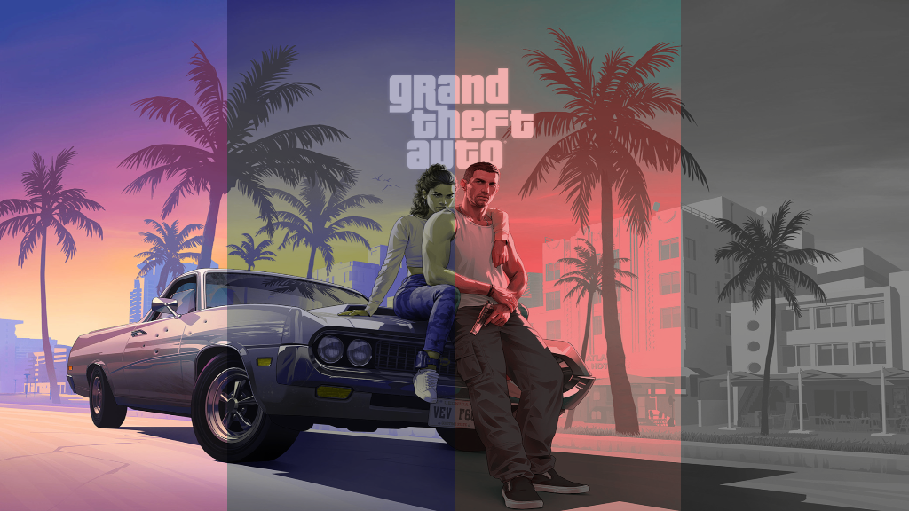
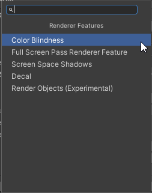
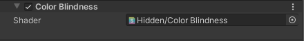
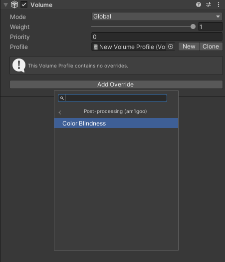
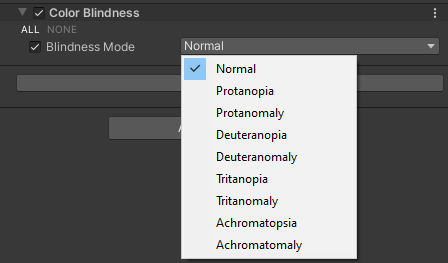

# Unity SRP 'Color Blindness' Post Effect
Simple package to get color blindness support into your game.
<p align="left">
  
</p>

## Features
Support of all major types of blindness:
- [x] Protanopia
- [x] Protanomaly
- [x] Deuteranopia
- [x] Deuteranomaly
- [x] Tritanopia
- [x] Tritanomaly
- [x] Achromatopsia
- [x] Achromatomaly

## How to install?

#### Unity Plugin
##### via Unity Package Manager
The latest version can be installed via [package manager](https://docs.unity3d.com/Manual/upm-ui-giturl.html) using following git URL:
```
https://github.com/am1goo/unity-srp-colorblindness.git#1.0.1
```

## How to use?
You can easily add support of this effect to every your URP projects in two simple steps:
#### 1) Add renderer feature to your URP Renderer
`Your Renderer Data` -> `Add Renderer Feature` -> `Color Blindness`
<p align="left">
  
  
</p>

#### 2) Add renderer override to your URP Volume
`Your Volume Profile` -> `Add Override` -> `Post-processing (am1goo)` -> `Color Blindness`
<p align="left">
  
  
</p>

That's it!

## Limitations
- *UI with Screen Space - Overlay* is not supported.

## Requirements
- Universal Render Pipeline 14.0.2

## Tested in
- Unity 2022.3.x

## Contribute
Contribution in any form is very welcome. Bugs, feature requests or feedback can be reported in form of Issues.
